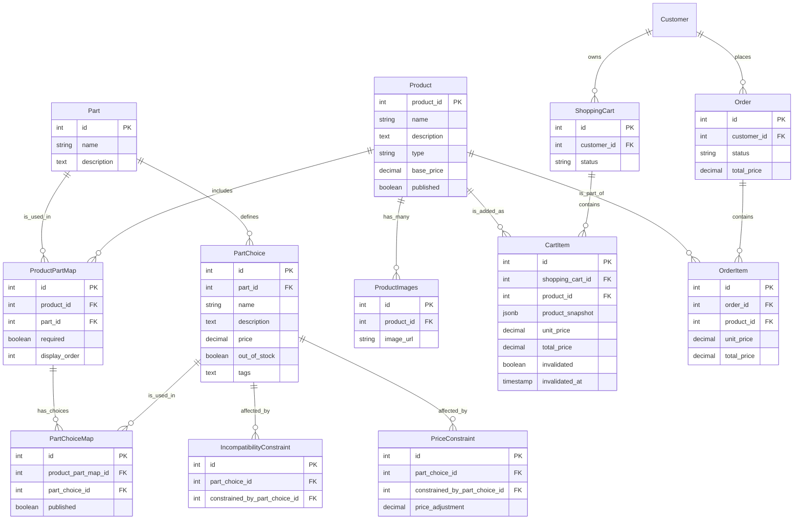
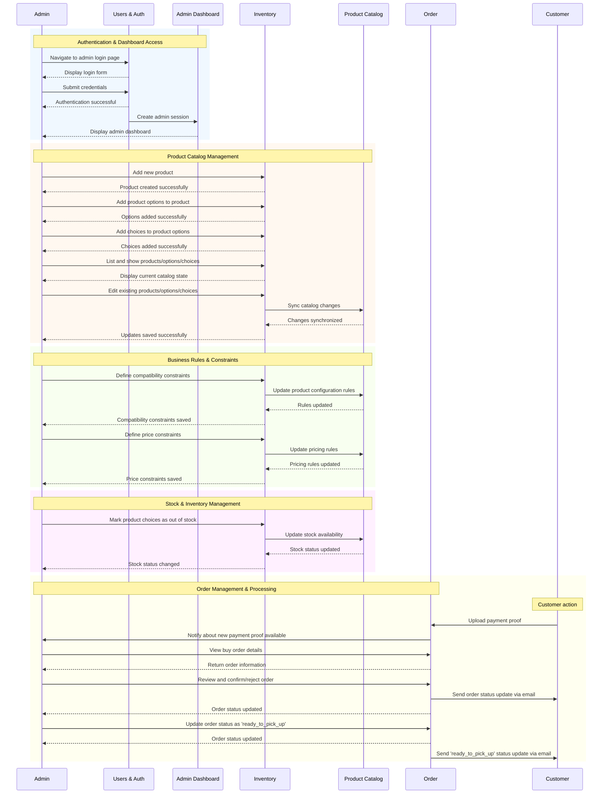

# Technical Design Document

## Functional Requirements

Customer:
- Customer registration and login.
- Customer can view the product details page.
- Customer can configure a product by selecting the required choices for each option.
- Customer can add one or more products to the shopping cart only if required choices are selected.
- Customer can remove products from the shopping cart.
- Customer can view the shopping cart page.
- Customer can click on the checkout button to proceed to the checkout page.
- Customer can view the checkout page.
- Customer can click on confirm button to create a buy order.
- Customer can view the buy order details page and the payee (Marcus's IBAN) information.
- Customer can upload the proof of payment to the buy order details page.
- Customer can view the order history page.
- Customer can print the invoice of the order.

Admin:
- Admin can view admin dashboard login page.
- Admin can login to the admin dashboard.
- Admin can Add, Edit, Delete, List and Show products.
  - Can publish or unpublish products.
- Admin can Add, Edit, Delete, List and Show product options.
- Admin can Add, Edit, Delete, List and Show product choices.
  - Can mark product choices as out of stock.
- Admin can Add, Edit, Delete, List and Show compatibility constraints.
- Admin can Add, Edit, Delete, List and Show price constraints.
- Admin can Edit, List and Show buy orders.
  - Can confirm or reject the buy order.
- Admin can invalidate a buy order draft by updating the stock of the part_choices.

## Non-Functional Requirements
- The application should have basic health checks, monitoring and logging.
- The product catalog search should respond in less than 2000ms.
- Use a platform guaranteeing high availability to host the application.
- Concurrent requests handling:
    - Normal Use: 1–5 users, 2–10 RPS
    - Promotional Peak: 10–20 users, 20–40 RPS
    - Stress Test Ceiling: 50 users, 100–150 RPS

## Design

In order to build a scalable and maintainable application as it is requested,we need to follow a few design principles.

- Identify the Core, Support and Generic domains so that the correct architecture is used.
  - CORE: These are domains that contain the differentiators of the application and/or the complex business logic. In this cases we want to favor the use of clean architecture, DDD and perhaps CQRS.
  - SUPPORT: These are domains that are necessary for the business but low enough in complexity to be implemented as CRUD and using ActiveRecord pattern. These domains can't be delegated to a 3rd party provider.
  - GENERIC: These domains are often delagated to 3rd party providers, given that many well-established applications already exist and are used by many companies. Examples of these domains are: E-Commerce, Payment, Shipping, etc.

**Note 1**: The following design principles are not a rule, but a guide to help us build a scalable and maintainable application.

**Note 2**: In real life I  would choose an already existing E-commerce platform like Shopify or BigCommerce, but for the sake of the exercise I have designed the following solution as a modular monolith.

### The Model

To meet the criteria of the MVP the following key modules have been identified:

- [CORE] **Product Catalog**: This module is to enable the search of products, displaying the product details, parts and choices, and manages the product configuration process which enforces the constraints and the price calculation.
- [CORE] **Checkout**: This module is responsible for creating an BuyOrder which the Admin is informed about and can manually review and confirm/reject. Although not part of the MVP, it could eventually use 3rd party providers to validate/process payments, fraud detection mechanisms, etc.
- [SUPPORT] **Inventory**: This module is responsible for managing the inventory of the products, PartChoice, options , their constraints and stock state. Allows only the admin to manage it.
- [SUPPORT] **Shopping Cart**: This module is responsible for creating a new ShoppingCart when the user adds a item to the cart. Enables the display of the contents of the cart.
- [SUPPORT] **Users & Auth**: This module is responsible managing the creations of customers and admins, and the authentication of users.
- [GENERIC] **Shipping**: Although not part of the MVP, it could eventually use 3rd party providers to calculate the shipping cost based on the address and the weight of the order and manage and deliver goods outside of the location of the owner.
- [GENERIC] **Payment**: Not part of the MVP, but rather than building a payment gateway from scratch, it would be cheaper to use a 3rd party provider like Stripe or PayPal. So that the checkout process directly uses the API of the provider. 

### Code Architecture

The folder structure for the project can be as follows:

```
src/
├── Store/
│   ├── Inventory/
│   │   ├── Product/
│   │   │   ├── Add/
│   │   │   ├── Edit/
│   │   │   ├── Delete/
│   │   │   ├── List/
│   │   │   ├── Show/
│   │   ├── Constraints/
│   │   │   ├── CRUD folders
│   │   ├── Options/
│   │   │   ├── CRUD folders
│   │   ├── Choices/
│   │   │   ├── CRUD folders
│   ├── ProductCatalog/ 
│   │   ├── Core/
│   │   │   ├── Entities/
│   │   │   ├── ValueObjects/
│   │   │   ├── Services/
│   │   ├── Actions/ 
│   │   ├── Infrastructure/ 
│   │   │   ├── Persistence/
│   │   │   ├── API Clients/
│   │   │   └── Event Bus/
│   │   └── Presentation/ 
│   │       ├── Controllers/
│   │       ├── Views/
│   ├── ShoppingCart/
│   │   ├── CRUD folders
│   ├── Checkout/
│   │   ├── Clean Architecture folders
├── Shared/
│   ├── EventBus/
│   ├── Logging/
```
Notes:
- The `Core` folder contains domain objects and services and is where the business logic resides.
- The `Actions` folder contains the entry points to the application.
- The `Infrastructure` folder contains code that allows to interact with external components.
- The `Presentation` folder contains code that allows to interact with the user.

### Database

Since scalability isn't a concern due to stage of Marcus's business, the MVP will use a relational database to execute write operations and store the data. It will guarantee data integrity and ease of use to join the different data tables.

Once the business scales and there are more products and users, a NoSQL database could be used to optimize read operations via a read model and a CQRS approach.

#### Relational Model

- `Product`: Represents a product in the catalog and is a collection of Parts.
- `Part`: Represents an option that can be configured for a product. Example: Frame, Wheels, etc.
- `PartChoice`: Represents a choice that can be made for an option. Example: Diamond Frame, Carbon Wheels, etc.
- `IncompatibilityConstraint`: Represents a constraint that if met, the choice is disabled. Example: Frame and Wheels must be compatible.
- `PriceConstraint`: Represents a constraint that if met, the choice has a price adjustment. Example: Full frame increase the price of Frame Finish because there is more surface area to paint.

Below is the entity relationship diagram for these database schemas.



## Implementation Notes

1. By using ProductPartMap and PartChoiceMap we can create multiple products with multiple parts and part choices. It allows to scale the inventory of similar products without duplicating data and increasing the maintainance burden.
2. Proper database indexing is crucial to improve the performance of the application and maintain a decent UX. Specially since many joins are required to be used.
3. The Order is created when the customer clicks on the checkout button and not after the payment is confirmed. The implementation considers that the payment is done manually by the Customer and is confirmed when the Customer uploads the proof of payment.
   1. By doing this, the Order can reserve the stock for the products.
   2. A background job can be used to relesea the stock after a certain time.
   3. The prices are calculated when the order is created in the backend side to avoid any data manipulation.
   4. Payment integration could be done after the MVP.


## Challenge Questions

### Data Model

<i>What data model would best support this application? Can you describe it? Include table specifications (or documents if it's a non-relational database) with fields, their associations, and the meaning of each entity.</i>

Please refer to the [Relational Model](#relational-model) section for the data model.

### Main User Actions

<i>Explain the main actions users would take on this e-commerce website in detail.</i>

Please refer to the [Functional Requirements](#functional-requirements) section for the main user actions.

### Product Page

<i>This is a read operation, performed when displaying a product page for the customer to purchase. How would you present this UI? How would you calculate which options are available? How would you calculate the price depending on the customer's selections?</i>

The product page will make a request to the /products/{id} endpoint to get the product details resource.

The product resource will contain all the necessary information to display the product details, prices and total price. The product resource will be a JSON object with the following structure:


```json
{
  "id": 1,
  "name": "Product 1",
  "type": "customizable",
  "description": "Product 1 description",
  "basePrice": 100,
  "currentTotalPrice": 1000,
  "parts": [
    {
      "id": 1,
      "name": "Part 1",
      "description": "Part 1 description",
      "price": 100,
      "displayOrder": 1,
      "partChoices": [
        {
          "id": 1,
          "name": "Choice 1",
          "description": "Choice 1 description",
          "price": 100,
          "outOfStock": false,
          "selected": false,
          "disabled": false,
        },
        {
          "id": 2,
          "name": "Choice 2",
          "description": "Choice 2 description",
          "price": 200,
          "outOfStock": false,
          "selected": false,
          "disabled": false,
        }
      ]
    },
    {
      "id": 2,
      "name": "Part 2",
      "description": "Part 2 description",
      "price": 200,
      "displayOrder": 2,
      "partChoices": [
        {
          "id": 3,
          "name": "Choice 3",
          "description": "Choice 3 description",
          "price": 300,
          "outOfStock": false,
          "selected": false,
          "disabled": false,
        },
        {
          "id": 4,
          "name": "Choice 4",
          "description": "Choice 4 description",
          "price": 400,
          "outOfStock": false,
          "selected": false,
          "disabled": false,
        }
      ]
    }
  ],
}
```

1. Some fields are excluded from the response to avoid unnecessary data for the Customer and other fields like Selected and Disabled are calculated in runtime by the backend and returned to the client application to avoid applying domain business rules in the frontend.
2. The currentTotalPrice is calculated by the backend and returned to the client application to avoid applying domain business rules in the frontend. It is calculated by gathering the selected part_choices and adding the product base_price + the part_choice.price and the price_constraint.price_adjustment (if applicable).
3. The displayOrder is used to sort the parts in the UI.
4. The selected field is used to indicate if the part_choice is selected by the Customer.
5. The disabled field is used to indicate if the part_choice is disabled by the system due to a compatibility constraint applied by a previously selected part_choice.
6. The backend expects the client to send previously selected part_choices + the new part_choice to be selected. The client will review and apply constraints again to all part_choices to calculate the currentTotalPrice.
   1. The incompatibility constraints are always applied first by the backend to disable them before attempting to apply the price constraints.
7. The data used to build the product resource is retrieved from the database by using views to optimize performance and decouple from the implementation details of the original tables.
   1. If the number of products and part_choices increase drastically, the views could be replaced by a read model to optimize performance which uses a more performant database able to handle heavy read operations. But initially it is not expected to be a problem and there is only one type of product (bikes) and the number of part_choices is expected to be low.


### Add to Cart Action

<i>Once the customer makes their selection, there should be an "add to cart" button. What happens when the customer clicks this button? What is persisted in the database?</i>

When the button is clicked, the system will generate a new ShoppingCart and a new CartItem and update the shopping cart icon to show the number of products in the cart.

<br>

`table: shopping_cart`

| columns               | type        | description |
|-----------------------|-------------|-------------|
| id                    | integer     | Primary Key
| customer_id           | integer     | FK to customer.id
| status                | string      |

<br>

`table: cart_item`

| columns               | type        | description |
|-----------------------|-------------|-------------|
| id                    | integer     | Primary Key
| shopping_cart_id      | integer     | FK to shopping_cart.id
| product_id            | integer     | FK to product.id
| product_configuration | jsonb       |
| unit_price            | decimal     |
| total_price           | decimal     |
| invalidated           | boolean     |
| invalidated_at        | timestamp   |

Note: The product_configuration is a json object that contains the product customised by the user, with the selected part_choices.


### Administrative Workflows

<i>Describe the main workflows for Marcus to manage his store.</i>

Flows:
- Inventory Management
  - Part Choice Management
  - Compatibility Constraint Management
  - Price Constraint Management
  - Stock Management
  - Part Management
  - Product Management
- Order Management
  - Review new orders and fulfill them
  - Review existing orders and update their status


Given that the part_choices have already been added to the system a typical admin workflow looks as follows:



### New Product Creation

What information is required to create a new product?

If it is a new "standard" product:
- Product 
  - name
  - type
  - base_price
  - description
  - images
  - published

This represents a non-customizable product that doesn't require any options or choices, nor compatibility constraints or price constraints.

If it is a new "customizable" product then:
- Product 
  - name
  - type
  - basePrice
  - description
  - images
  - published
- Part[]
  - name
  - published
- PartChoice[]
  - name
  - description
  - price
  - outOfStock
  - published
  - tags
  - incompatibleConstraints[] (optional)
  - priceConstraints[] (optional)

How does the database change?

To create a customizable Product different PartChoice need to be already available in the database. The part should be created first, these ones are the ones that represent the stock inventory.

Then the Part can be created to represent a collection of parts. In this process existing parts are assigned to the new Part.

Finally the product can be created with the new Part, that are assigned to it.

To avoid direct coupling between the product, Part and part tables, we can leverage mapping tables to represent the relationships.

<br>

`Table: product_part_map`

| columns             | type    |
|---------------------|---------|
| id                  | integer | 
| product_id          | integer | 
| part_id             | integer | 
| required            | boolean |

<br>

`Table: product_choice_map`

| columns             | type    |
|---------------------|---------|
| id                  | integer |
| product_part_map_id | integer |
| part_choice_id      | integer |
| published           | boolean |

This way, the Parts and PartChoices can be created independently and then assigned to the product.

### Adding a new part choice

How can Marcus introduce a new rim color? Describe the UI and how the database changes.

#### The UI can be as follows

1. Marcus can go to the PartChoice search page and filter by tags = "RIM_COLOR". In the results he can see the existing rim colors.
2. Marcus can click on the "Add part choice" button to create a new rim color.
3. The UI will show a side panel sliding in from the right with a form to fill the new rim color details.
4. Marcus can fill the form and click on the "Save" button.
5. The system will create the new rim color and redirect to the PartChoices search page by closing the side panel and showing a success floating message.
6. In the results he can see the new rim color.


#### How does it looks like in the database?

Let's asume that a RIM_COLOR part has part_id = 4 and seen in the table below. 

`Table: part`

| id | name | published |
|----|------|-----------|
| 1  | FRAME | true |
| 2  | WHEEL | true |
| 3  | SUSPENSION | true |
| 4  | RIM | true |
| 5  | BRAKE | true |
| 6  | BIKE_ACCESSORY | true |

And part_choice_id = 1, 2 and 3 already exist in the database. Each part_choice_id represents a different rim color, so when Marcus adds a new rim color, the system will create a new row in the part_choice table as seen below.

<br>

`Table: part_choice`

| id | name | description  | price | outOfStock | tags |
|----|------|-------------|-------|------------|----------|
| 1  | Black | Black rim color | 50 | false | RIM_COLOR,BLACK |
| 2  | Red | Red rim color | 90 | false | RIM_COLOR,RED |
| 3  | Blue | Blue rim color | 90 | false | RIM_COLOR,BLUE |
| (New) 4  | Green | Green rim color | 90 | false | RIM_COLOR,GREEN |

<br>

Lastly, when the part_choice is assigned to a product part, the system will create a new row in the product_choice_map table that matches the product_part_map_id for the corresponding product_id/part_id pair as seen below. Marcus can select if the part_choice is published or not.

`Table: product_choice_map`

| product_id | product_part_map_id | part_choice_id | published |
|------------|---------------------|----------------|-----------|
| 1          | 1                   | 1 (black)      | true      |
| 1          | 1                   | 2 (red)        | true      |
| 1          | 1                   | 3 (blue)       | true      |
| 1 (new)    | 1                   | 4 (green)      | false     |

## Setting Prices

<i>How can Marcus change the price of a specific part or specify particular pricing for combinations of choices? How does the UI and database handle this?</i>

### The UI can be as follows

1. Marcus can go to the PartChoice search page and filter by tags for the specific part. In the results he can see the existing part choices.
2. Marcus can click on the "Edit" button to edit the price of the part choice.
3. The UI will show a side panel sliding in from the right with a form to fill the part choice details and it will show the current price and compatibility constraints the part_choice has.
4. Marcus can modify the part_choice price and price_constraint in the form and click on the "Save" button.
5. The system will update the part choice price and redirect to the PartChoices search page by closing the side panel and showing a success floating message.
6. In the results he can see the updated part choice price.

Note: If the price_constraint is not set, the UI will display a button to add a new price_constraint on the spot.

### The database changes

- The price of specific parts (part_choice) can be changed by the admin by editing the part_choice table price column.
- The price of combinations of choices can be changed by the admin by editing the price_constraint table price_adjustment column of the specific part_choice.

<br>

`table: price_constraint`

| id | part_choice_id | constrained_by_part_choice_id | price_adjustment |
|----|----------------|-------------------------------|------------------|
| 1  | 1              | 2                             | 10               |
| 2  | 1              | 3                             | 15               |
| 3  | 2              | 1                             | 5                |
| 4  | 2              | 3                             | 8                |


